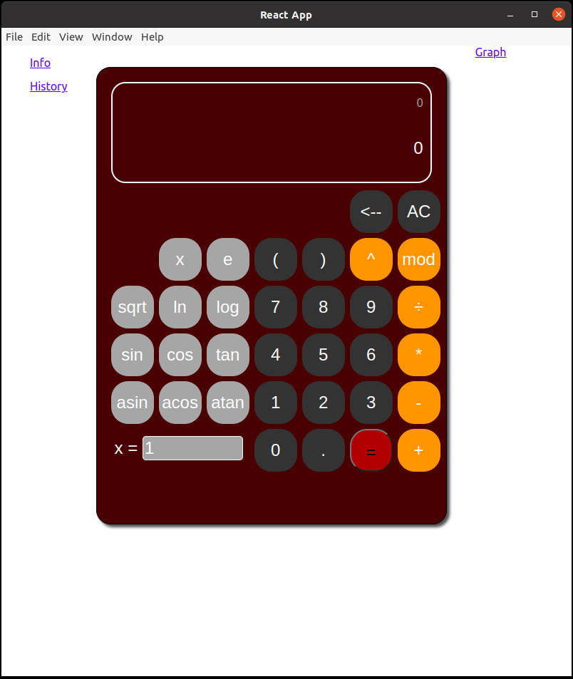
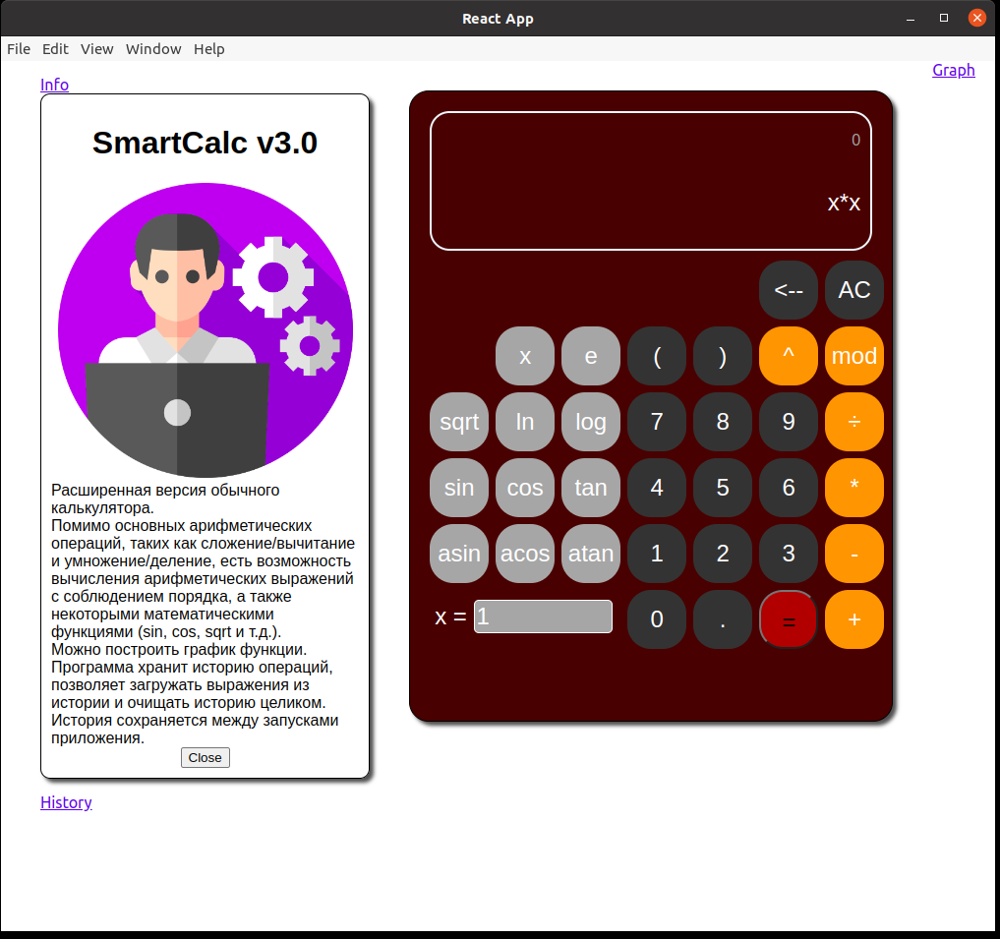
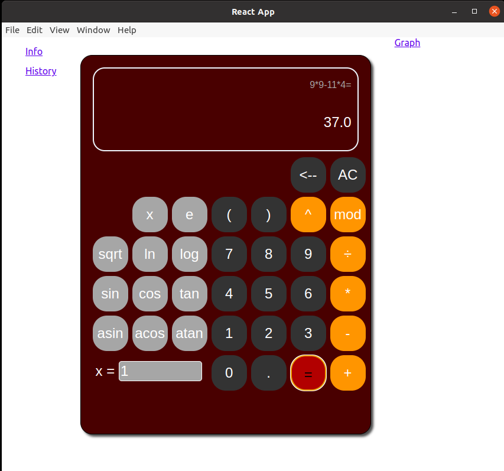
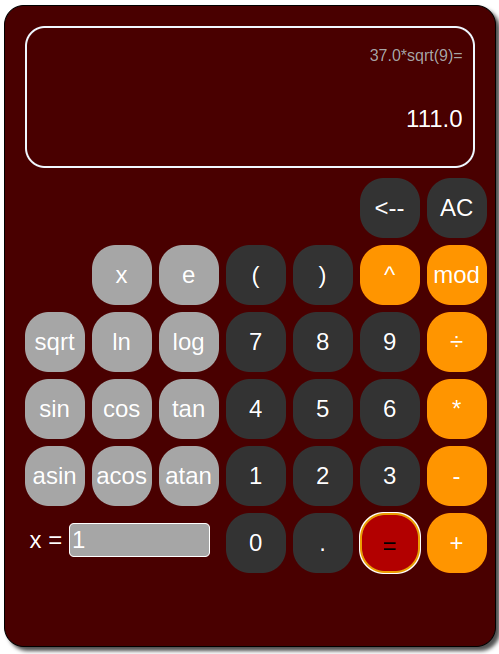
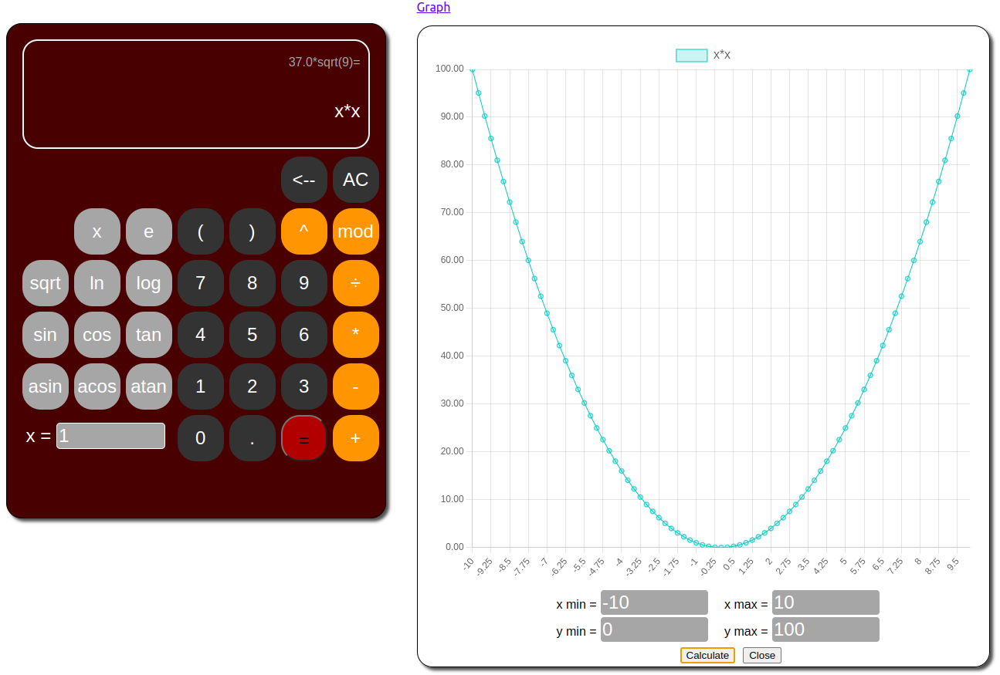
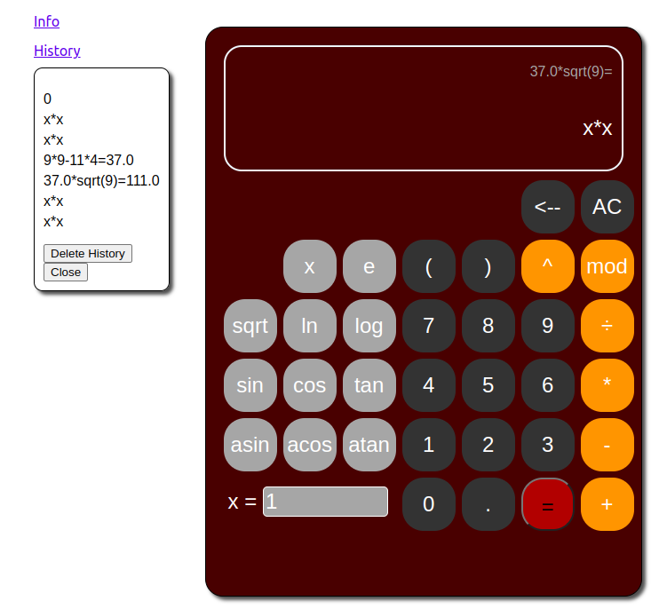

# Calculator
Расширенная версия обычного калькулятора.
  
Серверная часть:
- Spring Boot, RestController, Java, JNI, C++;

Клиентская часть:
- React JS, JavaScript, HTML, CSS, Electron.

Каждая часть приложения запускается отдельно.  
Можно запустить на Ubuntu двумя способами.  
Первый способ:  
1. Перейти в директорию SmartCalc;
2. `make` (запуск сервера, формирование установочного файла для клиентской части с расширением .deb)
3. `make run` (запуск клиента)  
Второй способ:  
1. Перейти в директорию SmartCalc;
2. `make runserver` (запуск сервера)
3. `make electron` (запуск клиента)  

Помимо основных арифметических операций, таких как сложение/вычитание и умножение/деление, можно вычислять арифметические выражения с соблюдением порядка приоритетов, а также некоторыми математическими функциями (sin, cos, sqrt и т.д.).  
Можно построить график функции.  
Программа хранит историю операций, позволяет загружать выражения из истории и очищать историю целиком.  
История сохраняется между запусками приложения.

